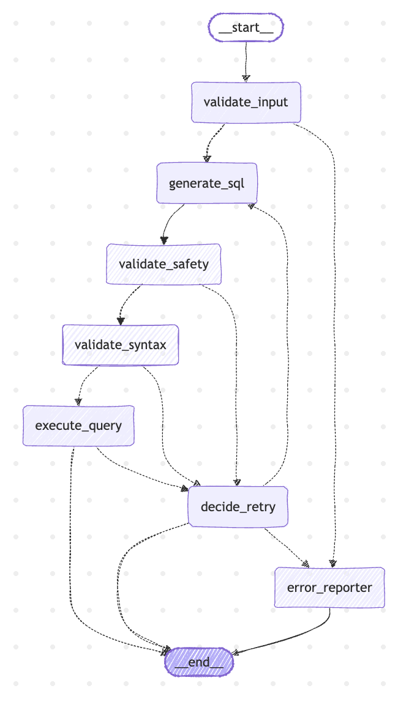
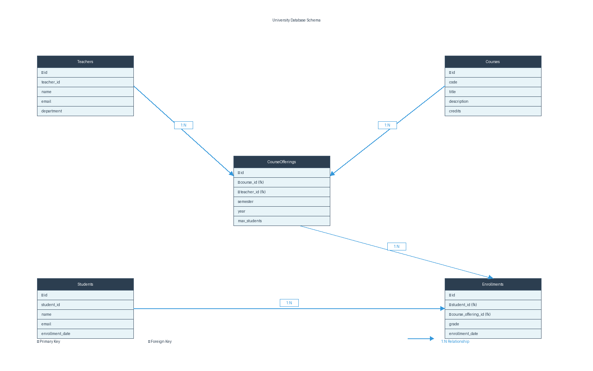

# University Database Q&A Agent

A LangGraph-based system that answers natural language questions about a university database by translating them to SQL and executing queries.

---

## Architecture

### Pipeline



7-node pipeline:

1. validate_input - Check question is valid, load schema
2. generate_sql - LLM generates SQL
3. validate_safety - Block DROP/DELETE/INSERT/UPDATE
4. validate_syntax - Ensure SELECT or WITH only
5. execute_query - Run SQL on database
6. decide_retry - Retry on failure (max 2 attempts) or route to error handling
7. error_reporter - Finalize response

---

### Database



Schema:
- Teachers: id, teacher_id, name, email, department
- Courses: id, code, title, description, credits
- CourseOfferings: id, course_id, teacher_id, semester, year, max_students
- Students: id, student_id, name, email, enrollment_date
- Enrollments: id, student_id, course_offering_id, grade, enrollment_date

Schema discovered at runtime via SQLAlchemy reflection. Works with SQLite, PostgreSQL, MySQL.

---

### Tracing

Full trace of each execution showing:
- User input
- Each LangGraph node executed
- SQL generated
- Database results
- Final answer

JSON trace output with timestamps, durations, token counts.

---

## Design

**DB-agnostic**: No hardcoded schemas. SQLAlchemy discovers structure at runtime. Same code works for SQLite, PostgreSQL, MySQL.

**Modular structure**: DB layer, agent logic, prompts, tracing in separate modules.

**Error handling**: Detects bad SQL, empty results, ambiguous questions. Retries with error feedback to LLM (up to 2 attempts).

---

## Design Decisions

**LangGraph over ReAct:** The task follows a deterministic sequence: question to SQL to execute. ReAct explores multiple reasoning paths and makes dynamic tool decisions, which adds latency and complexity here. LangGraph's fixed pipeline with explicit routing is faster (fewer API calls), more predictable for debugging, and appropriate for a well-defined task flow.

**Direct integration, no MCP:** MCP (Model Context Protocol) adds a protocol layer between the model and tools. For a single, tightly-scoped task, direct tool integration is simpler and more transparent. MCP's value comes when managing many diverse tools; we have one: SQL validation and execution.

**Custom tracer, not LangSmith:** A JSON tracer keeps execution data in your infrastructure without vendor lock-in. LangSmith is excellent for production use, but here the tracing needs are specific and minimal: token counts, timing, errors. For production, the JSON output pipes directly to your logging platform (CloudWatch, Datadog, Splunk).

---

## Setup

```
pip install -r requirements.txt
```

.env:
```
GEMINI_API_KEY=your-key
GEMINI_MODEL=gemini-2.5-flash
DATABASE_URL=sqlite:///university.db
FORCE_RESEED=true
```

---

## Running

```
python main.py
```

Outputs JSON with trace, question, answer.

---

## Testing

```
pytest tests/ -v
```

Tests: database queries, SQL generation, E2E flow.

---

## Project Structure

```
src/agent/
  ├── graph.py         LangGraph pipeline
  ├── tools.py         SQL validation, database tools
  ├── executor.py      Query execution
  ├── schema.py        Schema reflection
  └── __init__.py

src/database/
  ├── models.py        SQLAlchemy models
  ├── connection.py    Database engine
  └── seed.py          Sample data

src/tracing/
  ├── tracer.py        Event logging
  └── __init__.py

tests/
  ├── test_core.py
  └── conftest.py

main.py               Demo
requirements.txt     Dependencies
README.md            This file
```

---

## Production Considerations

**Caching:** I'd use Redis for result caching because same questions hit the cache instead of burning API calls. Semantic caching groups similar questions to cut costs even more.

**Cost efficiency:** For cost-sensitive work, I'd run Ollama locally (Llama 2, Mistral, etc) instead of API calls. It trades some latency for dramatically lower bills. The pipeline doesn't care - just swap the endpoint.

**Monitoring:** I'd pipe the JSON tracer to LangSmith or LangFuse for observability. MLflow if I'm iterating on prompts and tracking experiments.

**Scaling:** I'd put multiple instances behind Redis for shared rate limiting and schema cache. Since the pipeline is stateless, scaling is just adding pod replicas. SQLAlchemy already handles the connection pool.

**Error handling:** Current retry logic catches transient failures. For production, I'd add circuit breaker pattern to stop hammering the database on persistent outages instead of just retrying forever.

**Deployment:** I'd containerize with Docker first. For high volume, I'd use Kubernetes (EKS, GKE) with autoscaling based on queue depth. If the task gets more complex later, I'd consider ReAct. If managing many tools, I'd look at MCP. For cost optimization, custom prompt caching on repeated schema lookups.
